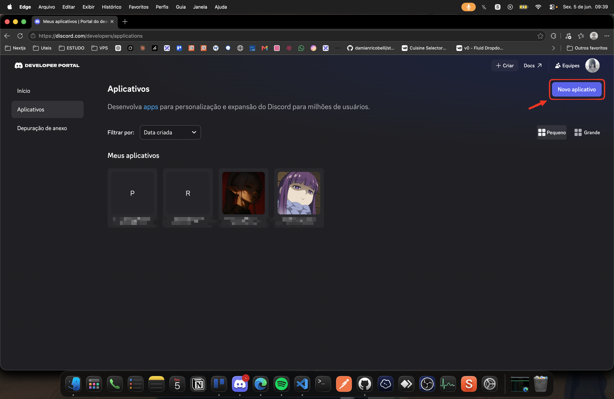
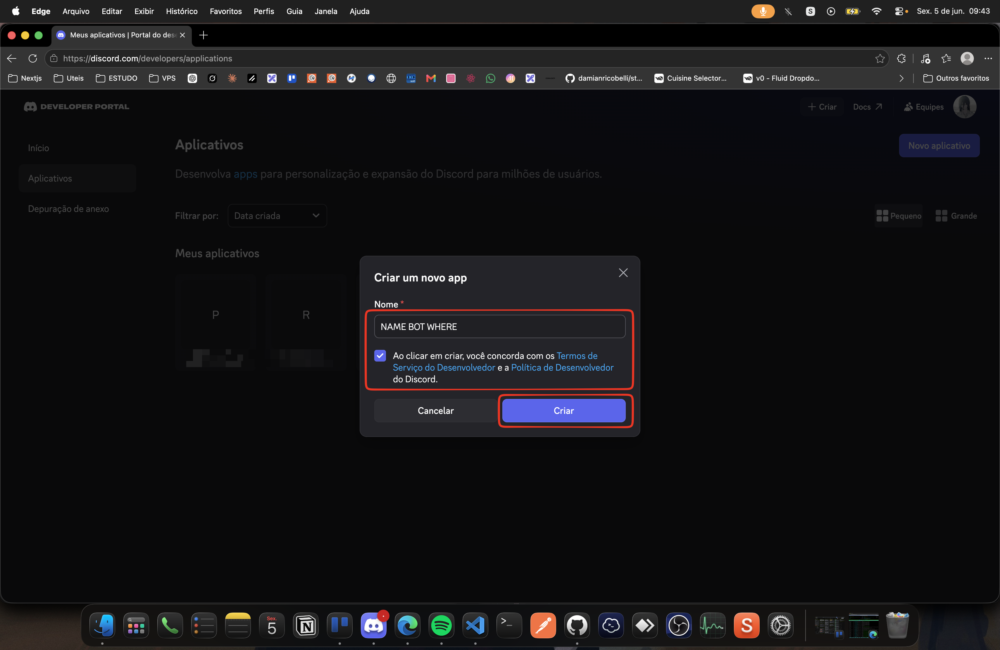
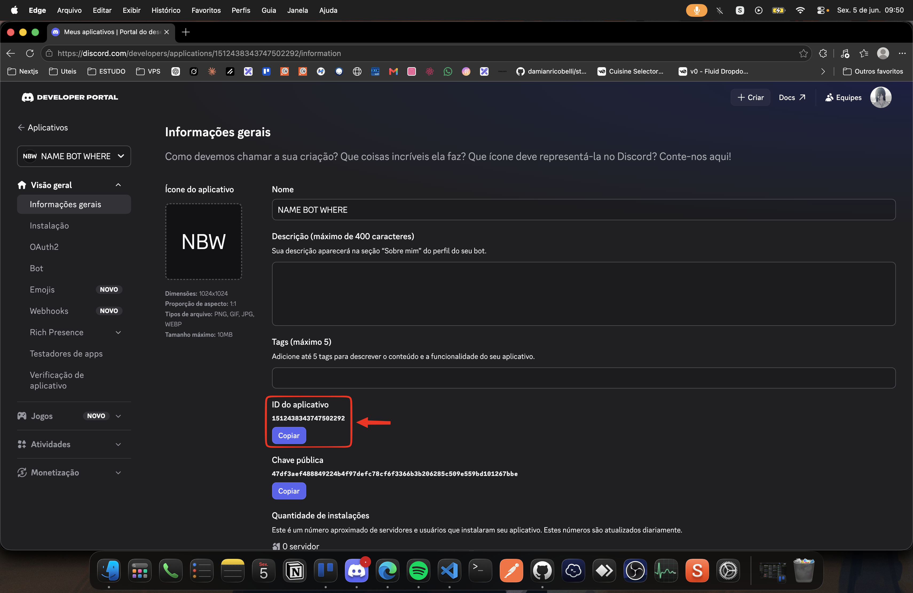
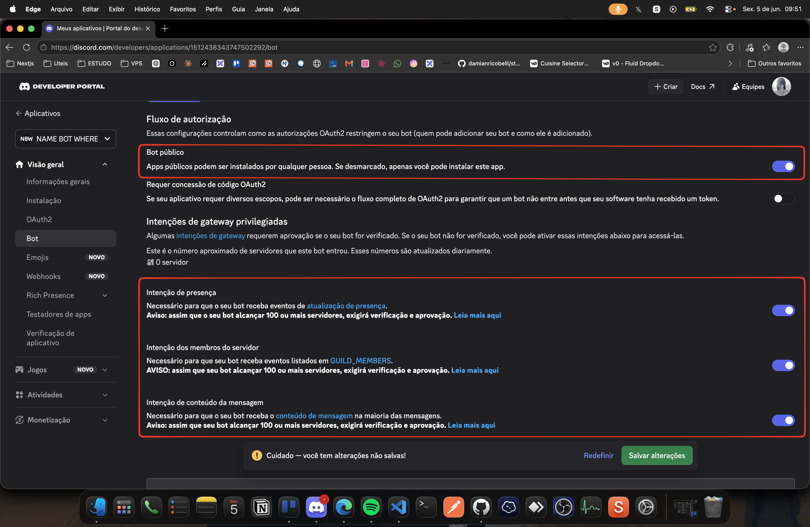
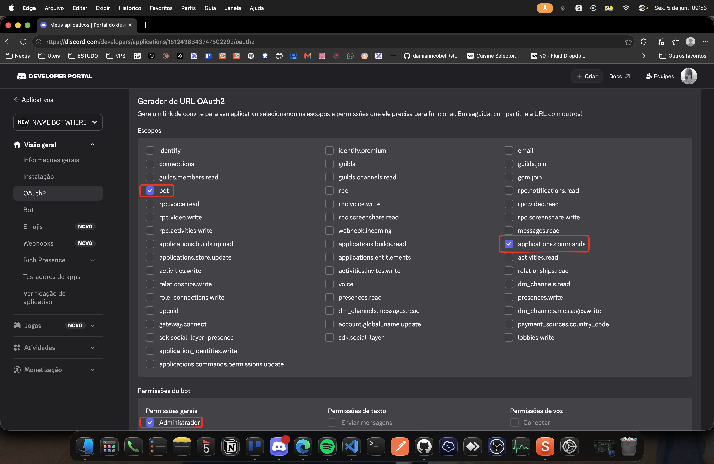
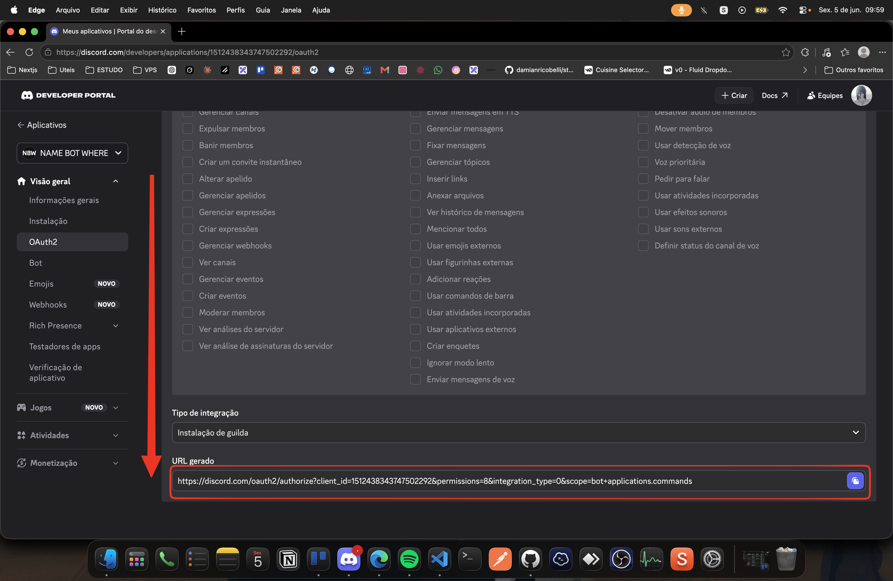
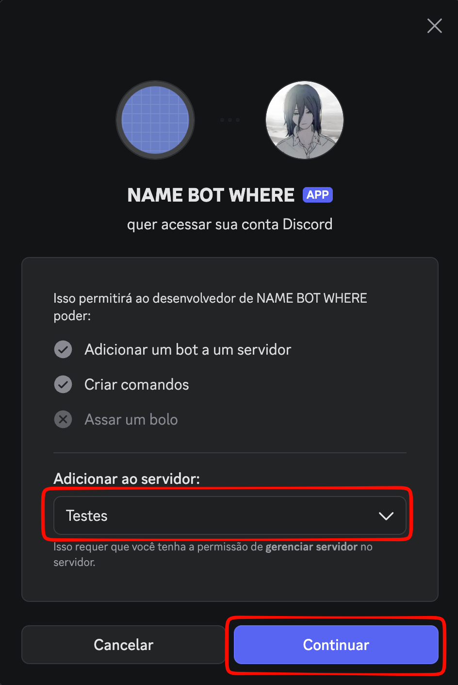
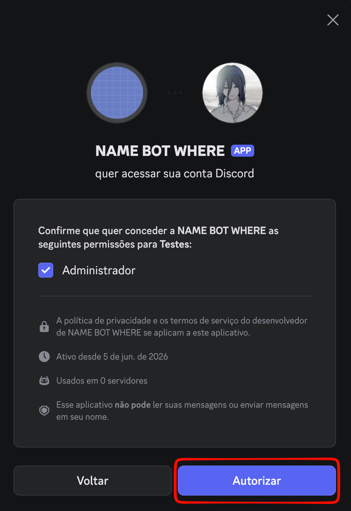
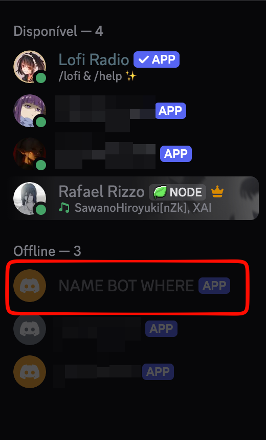
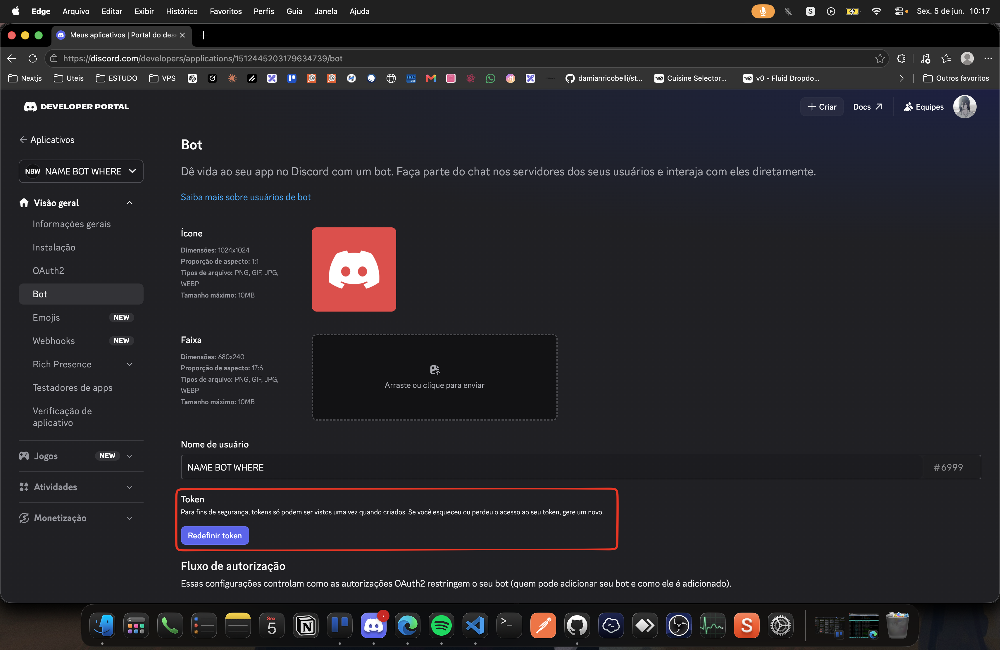

# Discord Helper Bot


Bot de Discord com slash commands dinâmicos via JSON e suporte a webhook autenticado com JWT/HMAC.

---

## Tecnologias

- Bun + TypeScript
- discord.js v14
- Docker + Docker Compose

---

## Criando o bot no Discord

Siga o passo a passo abaixo para criar e configurar o bot na plataforma do Discord:

| Passo | Descrição |
|-------|-----------|
| 1 | Acesse o [Discord Developer Portal](https://discord.com/developers/applications) e crie uma nova Application |
| 2 |  |
| 3 |  |
| 4 |  |
| 5 |  |
| 6 |  |
| 7 |  |
| 8 |  |
| 9 |  |
| 10 |  |
| 11 |  |

---

## Instalação

```bash
git clone <repo>
cd <repo>
bun install
```

---

## Configuração

Crie um `.env` na raiz com base no `.env-example`:

```env
DISCORD_TOKEN=""       # token do bot (Bot > Token)
CLIENT_ID=""           # ID da application (OAuth2 > Client ID)
GUILD_ID=""            # ID do servidor Discord
ALLOWED_CHANNELS=""    # IDs de canais permitidos, separados por vírgula (deixe vazio para todos)
BLOCKER_ENDPOINT=""    # URL do webhook que atualiza o bloqueador
JWT_TOKEN=""           # segredo HMAC-SHA256 para assinar o JWT
```

---

## Estrutura

```
src/
  index.ts              # bot principal
  deploy-commands.ts    # registra comandos no Discord

commands.json           # comandos dinâmicos
.env                    # variáveis de ambiente (não versionar)
```

---

## Como funciona

Comandos são definidos no `commands.json`:

```json
[
  {
    "name": "ping",
    "description": "Teste de conexão",
    "response": "Pong!"
  }
]
```

O bot lê o JSON na inicialização, registra os comandos no Discord e responde automaticamente com o `response` configurado.

### Comandos reservados

Estes comandos têm comportamento especial e **não podem** ser definidos no `commands.json`:

| Comando | Descrição |
|---------|-----------|
| `/help` | Lista todos os comandos disponíveis (ephemeral) |
| `/atualizar-bloqueador` | Chama o `BLOCKER_ENDPOINT` via POST com JWT e anuncia o resultado publicamente no canal |

O `/atualizar-bloqueador` gera um JWT HS256 assinado com `JWT_TOKEN` (expira em 60s) e envia como `Authorization: Bearer <token>`. Aguarda até 60 segundos pela resposta.

---

## Executar

### Desenvolvimento

```bash
# instalar dependências
bun install

# registrar os comandos no Discord (rode sempre que adicionar/remover comandos)
bun run deploy

# iniciar o bot com hot reload
bun run dev
```

### Produção (Docker)

```bash
# clonar e entrar no repositório
git clone <repo>
cd <repo>

# criar o .env a partir do exemplo
cp .env-example .env
# edite o .env com os valores corretos

# build e subir o container
docker compose up -d --build

# acompanhar logs
docker logs -f pdc-blocker
```

> O `docker compose up` já executa o `deploy-commands` automaticamente antes de iniciar o bot.

---

## Restrição por canal

```env
ALLOWED_CHANNELS="123456789,987654321"
```

- Com IDs definidos: responde apenas nesses canais; demais recebem erro ephemeral
- Vazio: funciona em qualquer canal

---

## Limitações

- Respostas limitadas a 2000 caracteres (limite do Discord)
- Nomes de comandos: minúsculos, sem espaços, sem acentos
- `@everyone` e `@here` são bloqueados nas respostas do `commands.json`

---

## Segurança

- Nunca versione o `.env`
- Nunca logue tokens ou secrets
- Use respostas ephemeral (`flags: 64`) para dados sensíveis

---

## Licença

MIT
